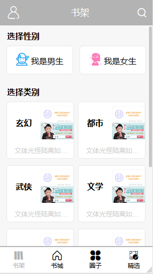

# vue-Agoni-story
基于vue的小说网站

# 技术栈
vue2 + vuex + vue-router + axios + localStorage

# 关于接口数据
此项目的所有接口数据都来源于配套的后台系统，[后台项目传送地址](https://github.com/jackect1103/node-express-storyServe)。

同时也提供了基于element-ui搭建的[后台管理页面](https://github.com/jackect1103/vue-element-agoni)

# 小说网站效果图




=======
# story

## Project setup
```  
npm install
```

### Compiles and hot-reloads for development
```
npm run serve
```

### Compiles and minifies for production
```
npm run build
```

### Run your tests
```
npm run test
```

### Lints and fixes files
```
npm run lint
```

### Customize configuration
See [Configuration Reference](https://cli.vuejs.org/config/).

